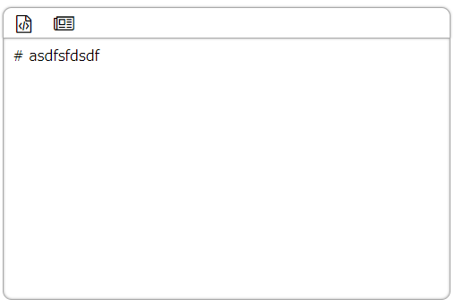
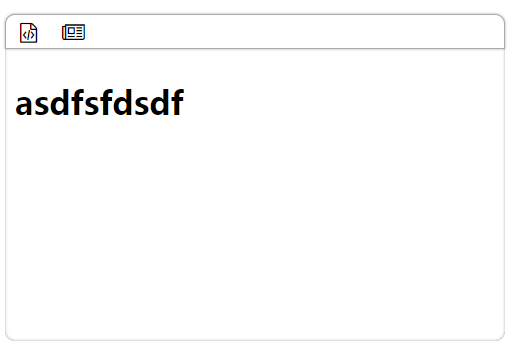

## 简陋的markdown 编辑器

### 效果图

代码图

预览图
### 实现

1. tab插入4个空格
2. ctrl + s 阻止
3. 预览使用的开源库[marked](https://github.com/markedjs/marked)

### 使用

html

	<link rel="stylesheet" href="https://cdn.bootcss.com/font-awesome/4.7.0/css/font-awesome.min.css">
	<link rel="stylesheet" href="css/markdown.css">
	

		<textarea></textarea>
	

	
	
	

js

	var md = new Markdown("#md")

### 参数及方法

** Markdown(selector[,options]) ** 

|参数|类型|含义|
|---|---|---|
|selector|String|css属性选择器|
|ops|Object|配置参数,可以忽略|
|ops.width|Number|默认为100%|
|ops.height|Number|默认为300px|
|ops.fontSize|Number|默认为16px|
|ops.lineHeight|Number|默认为1.3em|

** Markdown.prototype **

|函数|参数|返回值|
|---|---|---|
|getMd|null|编辑框中的markdown代码|
|getHtml|null|获取转换后的html结构|
|getLineNum|null|获取当前编辑器总行数|

### 预计增加

1. 图片上传
2. 图片选择
3. 便捷工具
	+ 链接添加
	+ 粗体
	+ 斜体
	+ 删除线
	+ 下划线
	+ 代码
	+ 代码行
	+ 增加表格
	+ 插入时间

4. 增加默认html解析
	+ 例如增加版权信息等
5. 撤销/重做
	

